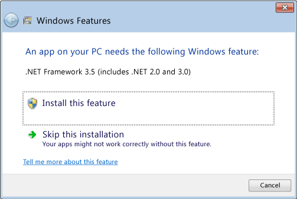
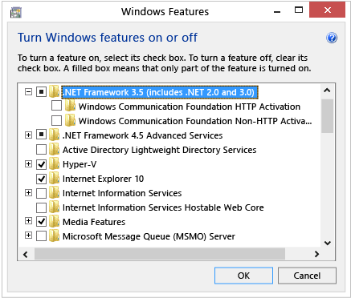

# Install the .NET Framework 3.5 on Windows 10, Windows 8.1, and Windows 8

You may need the .NET Framework 3.5 to run an app on Windows 10, Windows 8.1, and Windows 8. You can also use these instructions for earlier Windows versions.

## Install the .NET Framework 3.5 on Demand

You may see the following configuration dialog if you try to run an app that requires the .NET Framework 3.5. Choose **Install this feature** to enable the .NET Framework 3.5. This option requires an Internet connection.

### Why am I getting this pop-up?

The .NET Framework is created by Microsoft and provides an environment for running applications. There are different versions available. Many companies develop their apps to run using the .NET Framework, and these apps target a specific version. If you see this pop-up, you're trying to run an application that requires the .NET Framework version 3.5, but that version is not installed on your system.

## Enable the .NET Framework 3.5 in Control Panel

You can enable the .NET Framework 3.5 through the Windows Control Panel. This option requires an Internet connection.

1. Press the Windows key  on your keyboard, type "Windows Features", and press Enter. The **Turn Windows features on or off** dialog box appears.

2. Select the **.NET Framework 3.5 (includes .NET 2.0 and 3.0)** check box, select **OK**, and reboot your computer if prompted.

   

   You don't need to select the child items for **Windows Communication Foundation (WCF) HTTP Activation** and **Windows Communication Foundation (WCF) Non-HTTP Activation** unless you're a developer or server administrator who requires this functionality.

## Troubleshoot the installation of the .NET Framework 3.5

During installation, you may encounter error 0x800f0906, 0x800f0907, 0x800f081f, or 0x800F0922, in which case refer to [.NET Framework 3.5 installation error: 0x800f0906, 0x800f0907, or 0x800f081f](https://support.microsoft.com/help/2734782/net-framework-3-5-installation-error-0x800f0906--0x800f081f--0x800f09) to see how to resolve these issues.

If you still can't resolve your installation issue or you don't have an Internet connection, you can try installing it using your Windows installation media. For more information, see [Deploy .NET Framework 3.5 by using Deployment Image Servicing and Management (DISM)](/windows-hardware/manufacture/desktop/deploy-net-framework-35-by-using-deployment-image-servicing-and-management--dism). If you don't have the installation media, see [Create installation media for Windows](https://support.microsoft.com/help/15088/windows-create-installation-media).

> [!WARNING]
> If you're not relying on Windows Update as the source for installing the .NET Framework 3.5, you must ensure to strictly use sources from the same corresponding Windows operating system version. Using a source path that doesn't correspond to the same version of Windows won't prevent a mismatched version of .NET Framework 3.5 from being installed. However, this will cause the system to be in an unsupported and unserviceable state.
